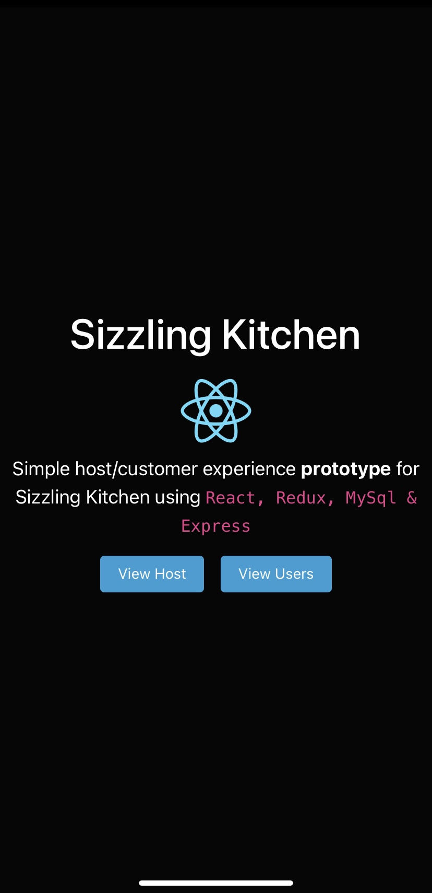
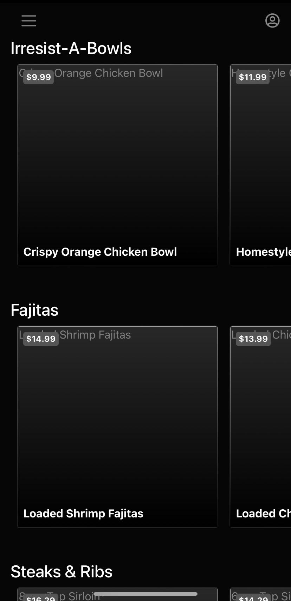
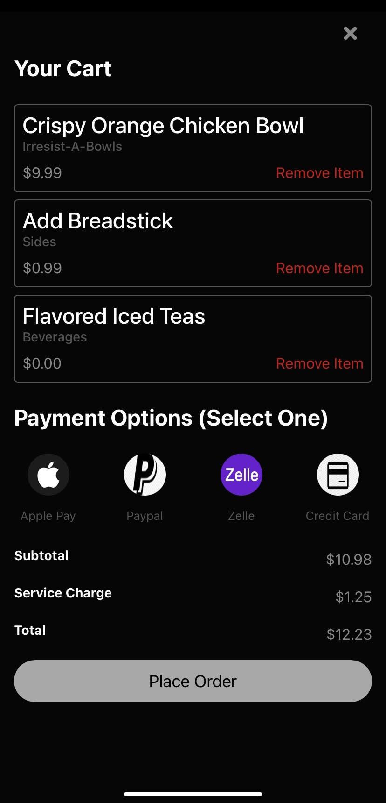
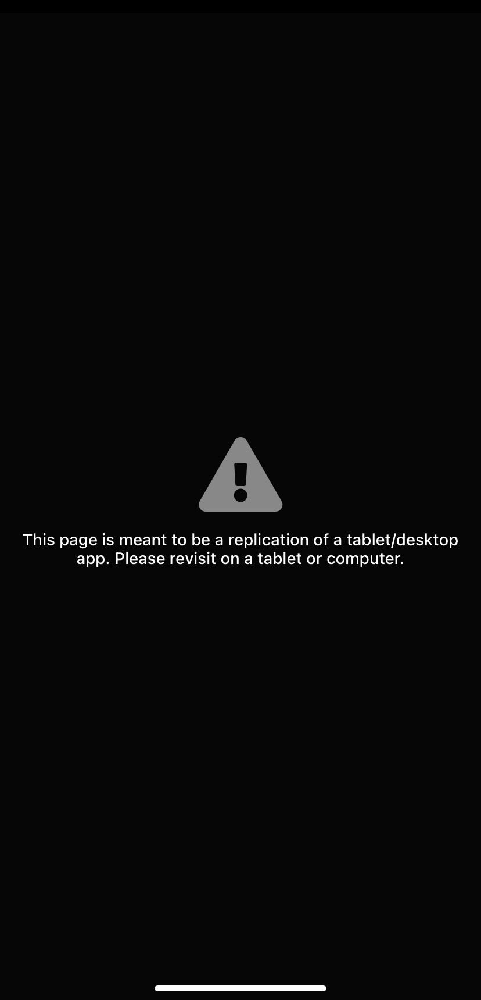
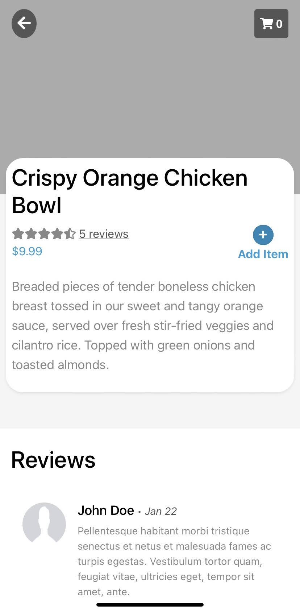
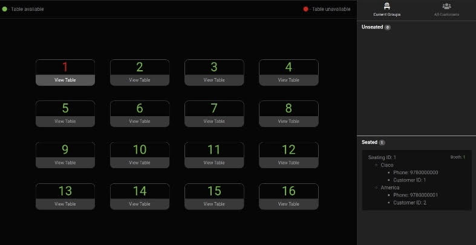
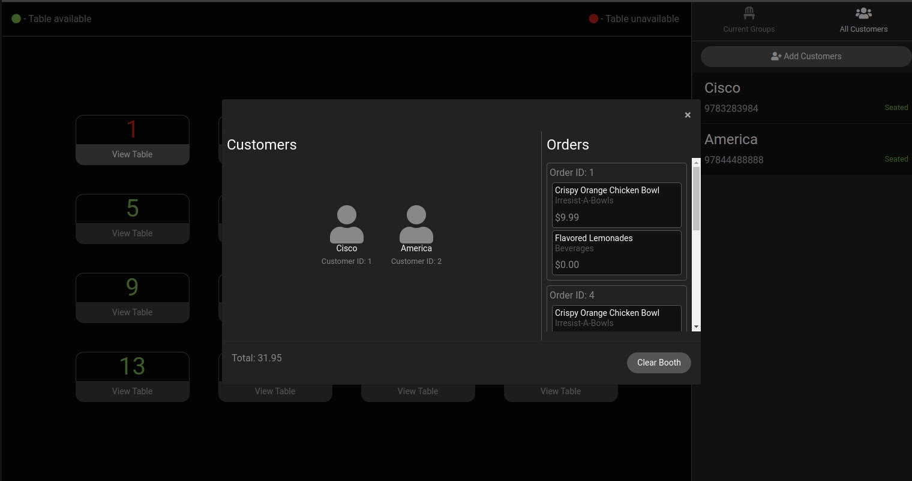

# Sizzling - Cisco Ducasse

[Link to visit app here.](https://sizzling.herokuapp.com)

## Tech Stack

- React
- MySQL/ Sequelize ORM
- Node.js/ Express.js
- Redux
- Bootstrap / Reactstrap
- Sass

I have a friend who's family owns a restaurant and he explained to me an idea that I thought really made sense. Basically the idea is that clients of a restaurant would have an option to schedule a table and order food before they even get to the restaurant. They can have an app where they can see restaurants and menus around them, order food and either dine in and have the food warm by the time they sit or eat out.

I decided to make a multi-user app. One half replicates clients looking to eat, and the other is the host of the restaurant. For the client, its strictly mobile-only design enables users to a specific UI that lets them search for restuarants around them and view the menu connected to that place. For the host, I pictured something lightweight like a table and they can view all the tables in their location, see what users are at what table, and see what each user has ordered. They can also check in users and assign to a table to keep track of what tables are available.

I'm using Express/MySQL to serve data from the server. React is displaying all the UI components, and I'm also using Redux to keep track of relations between users.

#### Images

#### Todos

- Find new images to display since Applebees changed their api that serves images
- Add sockets to stream data between host/clients more smoothly.
